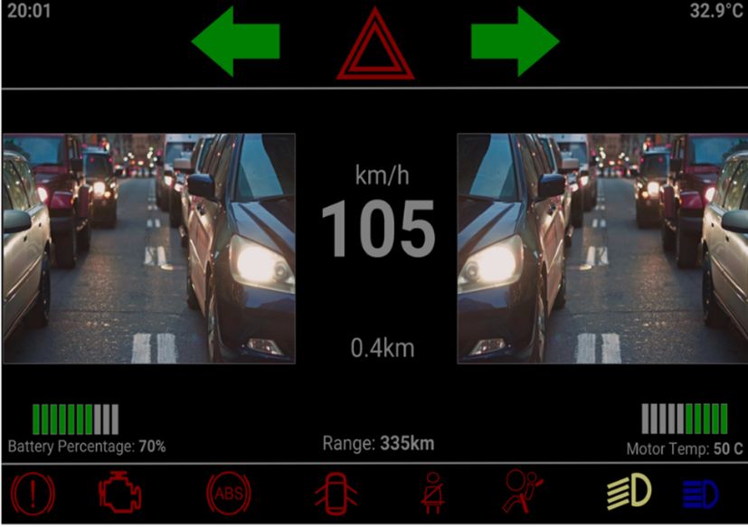

# Android Solar Car Heads-up display system

This Heads-up system is able to display real-time information of the car on the driver side and passenger side respectively with two tablets, a rear-view camera that is connected to the HUD and can display the rear view of the solar car constantly, and the driver HUD app that display the vision of two sides of the solar car constantly via two side-view cameras.

## Features

- General Information - Date, Outside Temperature
- Car real-time information - Digital Speedometer, Travelled distance, Indicator status, High/low beam status, Motor Temp.
- Battery Information - Batter status, Range
- Warning Icons - Handbrake, Check Motor, ABS, Car Door, Seatbelt, Airbag

